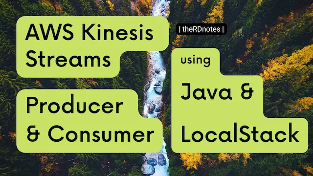

  
[Video Link](https://youtu.be/95ZgCv9cnls)  

This video demonstrates implementation of AWS Kinesis Producer and Consumer using Java + LocalStack setup.

Includes some experiments with the consumer also 🤩.

It uses AWS KPL(Kinesis Producer Library) and KCL(Kinesis Consumer Library) for Java.

------------------
Links:
------------------

GitHub repo: https://github.com/raevilman/vlog-kinesis-producer-consumer-java-localstack

---

|  HIH  
|  Take care  
~ @raevilman