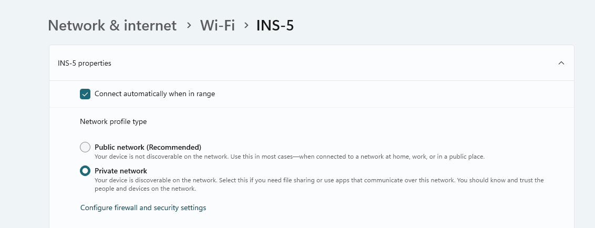
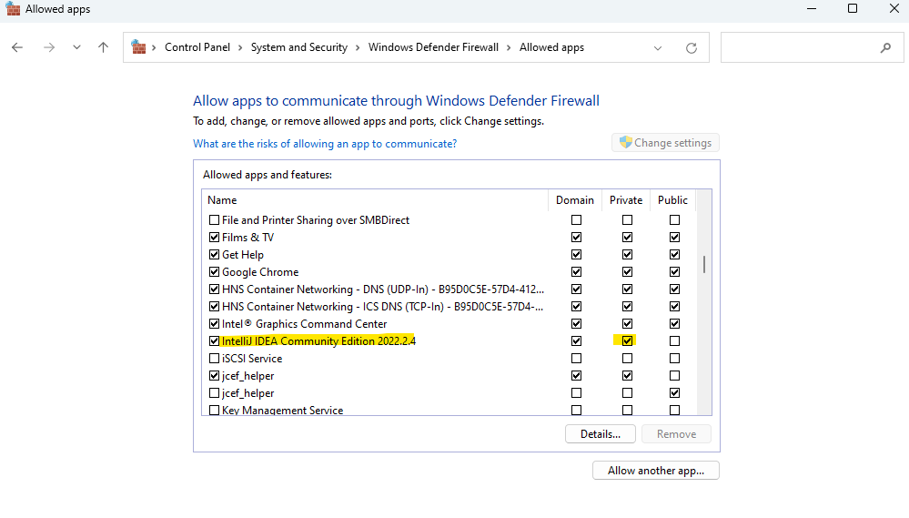
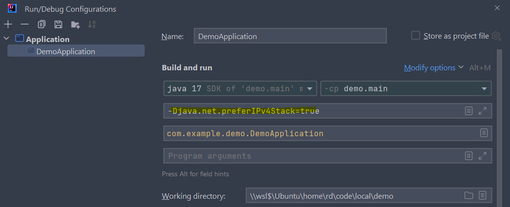

Steps, I've taken to debug apps on WSL.  

## #1 Note the network type you are connected to
I was working on my home network, so I marked it as private network.  

  

## #2 Make sure IntelliJ is allowed on the network type  

As I am connected to private network, IntelliJ should be allowed on same as shown below  




## #3 Use IP4 for debugging
I used below JVM parameter in the run configurations of Intellij  

```
-Djava.net.preferIPv4Stack=true
```

as shown below  



and I was able to connect to the debugger 🤘  

---

PS: HIH
~RD