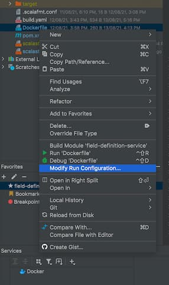
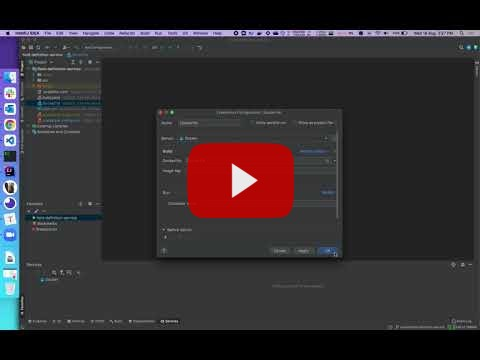

## Problem

This note is regarding one issue I faced yesterday, where in I wasn't able to edit the docker configuration which was added using the option in context menu of DockerFile, as shown below:

## Solution

The solution was to get rid of this corrupted configuration and add a new one using edit configurations dialog itself.  
I've recorded the below vlog about it.  

HIH
