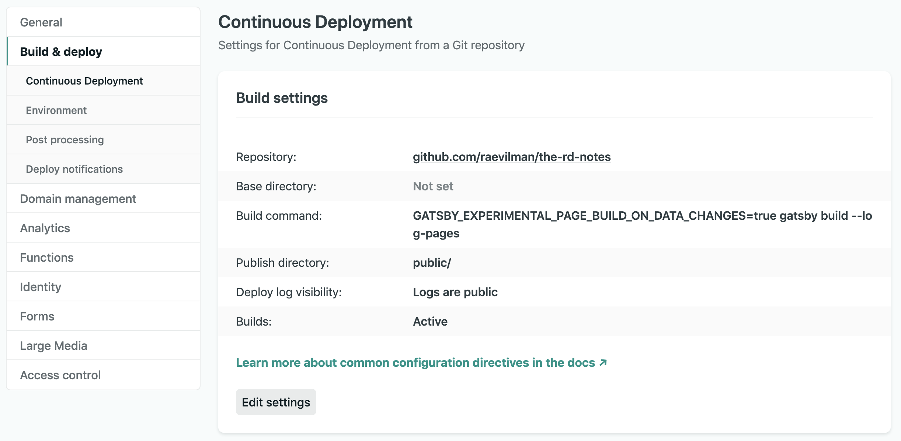
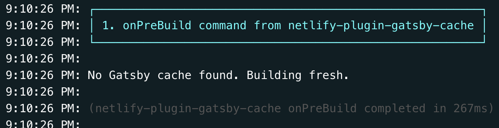
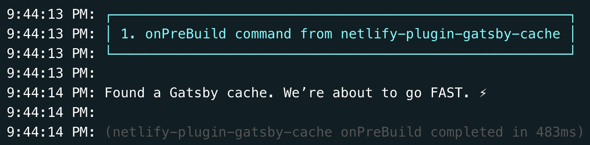

## Configuration

This note is about enabling the incremental builds feature released by Gatsby team couple of months back in Netlify.  

I followed this [article](https://www.netlify.com/blog/2020/04/23/enable-gatsby-incremental-builds-on-netlify/) and below are the steps I did:  

### 1. Enable the plugin

Created a new file `netlify.toml` in root and added following content to it.  
```
[[plugins]]
  package = "netlify-plugin-gatsby-cache"
```
 This enables the said plugin in the build process in Netlify.

### 2. Add flag

Added the following flag to the build command in package.json
 ```
"build": "GATSBY_EXPERIMENTAL_PAGE_BUILD_ON_DATA_CHANGES=true gatsby build --log-pages"
 ```
---
## Issues
### > Issue 1
It didn't work, So i updated the build command on [Netlify website](https://app.netlify.com/sites/nifty-ride-238d45/settings/deploys#build-settings)  



### > Issue 2
then I found below in the logs



Its a known issue that the plugin doesn't work for preview deploys, at the time of writing this note.  
(GitHub Issue: https://github.com/jlengstorf/netlify-plugin-gatsby-cache/issues/22)


But on production deploys, the plugin seems to find the cache perfectly fine.




We'll see how today's configuration unfolds with future builds.

Till next time! ✌️

---
This [GitHub commit](https://github.com/raevilman/the-rd-notes/pull/5/commits/4f86bddada59ca49ab205e1b82f6ebb60035c2d5) represents what we've done in this post 🤩
