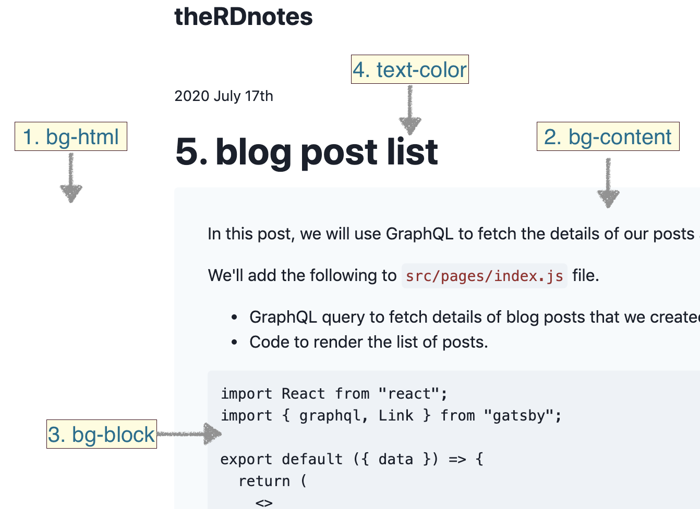

## Themes 🎨 🤩

Not everyone likes to read on vanilla setup with white background and black text color. Therefore we'll add few awesome themes to choose from.

We'll setup two themes and some kind of control to switch between them.

Following are the steps we'll do for this:

- Define theme (no code. just thinking)
- Tell tailwind about the definition
- Create instances of the theme definition
- Refactor code to utilise these new themes
- Implement a control to switch themes
- Persist user selection

### Theme definition

Theme is nothing but a set of colors that we apply to different parts of our website.

So the first thing we need to do is to decide following:

- a) What are the parts of the website for which we want to change color on theme switching?
- b) What all colors do we need for those parts? (we'll talk about this while creating theme instances)

For this blog, I could think of following parts as of now:

- background color for the html
- background color for the content block
- background color the code section
- text color



### Inform tailwind

Now that we have decided on the parts we want to color. Next step is tell tailwind about these variables.

For this we'll edit `tailwind.config.js` and extend the theme object by adding keys for these colors to it as follows:

```js
module.exports = {
  corePlugins: {
    // preflight: false,
  },
  purge: ["./src/**/*.js", "./src/**/*.jsx", "./src/**/*.ts", "./src/**/*.tsx"],
  theme: {
    extend: {
      textColor: {
        default: "var(--color-text-default)",
      },
      backgroundColor: {
        html: "var(--color-bg-html)",
        content: "var(--color-bg-content)",
        block: "var(--color-bg-block)",
      },
    },
  },
  variants: {},
  plugins: [],
};
```

### Theme instances

This is the fun part 🤩, where I get to play with colors to define different themes for our blog.

I am going to define two themes for now (may be more later bcz its fun):

- Vanilla (plain, default, basic white-gray based theme)
- Sunset (kindle inspired theme)

And we'll assign color to each decided part per theme.

For this I've added following to a new file `src/css/themes.css`:

```css
.theme-vanilla {
  --color-bg-html: theme("colors.white");
  --color-bg-content: theme("colors.gray.100");
  --color-bg-block: theme("colors.gray.200");
  --color-text-default: theme("colors.gray.900");
}

.theme-sunset {
  --color-bg-html: #fbf5e9;
  --color-bg-content: #fbf0d9;
  --color-bg-block: #fbe5b5;
  --color-text-default: #5f4b32;
}
```

> Notice how i am assigning color hex values in two different ways.
>
> 1. In vanilla, I have used colors from tailwind
> 2. In sunset, I have hardcoded the specific values

and imported it in `src/css/index.css` as follows:

```css
@import "themes.css";
```

### Using themes

We are all set to use the themes now. We just need to target the right html element and assign it the right `className`.

So basically, we need to assign `className` for:

- 4 background colors (`bg-html`, `bg-content`, `bg-block`, `text-default`)
- 1 theme name (`theme-vanilla` or `theme-sunset`)

#### bg colors

Following is how I've assigned the bg colors:

- `bg-html` & `text-default` is assigned to the root `div` of `Layout.js`
- `bg-content` is assigned to `main` element of `Content.js`
- `bg-block` is assigned to `code` css block in `src/css/unreset.css`

#### theme name

- theme class is assigned to the root `div` of `Layout.js`

### Switch control

I am using `useState` to store theme value in `Layout.js` with initial value set to `vanilla` as below:

```js
const [theme, setTheme] = useState("vanilla");
```

and I am passing both `theme` and `setTheme` to `Header.js`, where I have implemented the controls to switch the theme:

```js
<div
  className={`${
    !isMenuOpen ? "hidden" : ""
  } flex justify-between flex-row-reverse items-center sm:items-end bg-content rounded px-8 py-4`}
>
  <div className="flex flex-col">
    <span className="text-xl font-medium pb-2">Themes</span>
    <button
      type="button"
      onClick={() => setTheme("sunset")}
      className={` ${theme === "sunset" ? "bg-block" : ""} focus:outline-none`}
    >
      Sunset
    </button>
    <button
      type="button"
      onClick={() => setTheme("vanilla")}
      className={` ${theme === "vanilla" ? "bg-block" : ""} focus:outline-none`}
    >
      Vanilla
    </button>
  </div>
</div>
```
> Please refer to the full code if required in GitHub commit mentioned at the end of this note.  

### Persist the theme !

For persisting the user selected theme value, I am using `localStorage`.  

For writing to `localStorage` I am using `useEffect` on `theme` const in `Layout.js` as below:  
```js
useEffect(() => {
    window.localStorage.setItem("theme", theme);
  }, [theme]);
```

and theme const is being initialized as below:  
```js
const [theme, setTheme] = useState(() => {
    if (typeof window !== `undefined`) {
      return localStorage.getItem("theme") ? localStorage.getItem("theme") : "vanilla";
    }
  });
```
> Using checks on `window` because web APIs are not available while SSR (server side rendering)  


Thats all folks!  
HIH
---  
Resources

- Sunset color code: https://medium.com/greatnote/kindle-sepia-color-code-1fed14b1a5ef

---

These GitHub [commit 1](https://github.com/raevilman/the-rd-notes/commit/434b9e9512ffa7ab33babab2620fa1fc8c77cc4b), [commit 2](https://github.com/raevilman/the-rd-notes/pull/7/commits/e71c8580f4aa8ae399cb627d7fe954443a82fa0e) represents what we've done in this post 🤩
