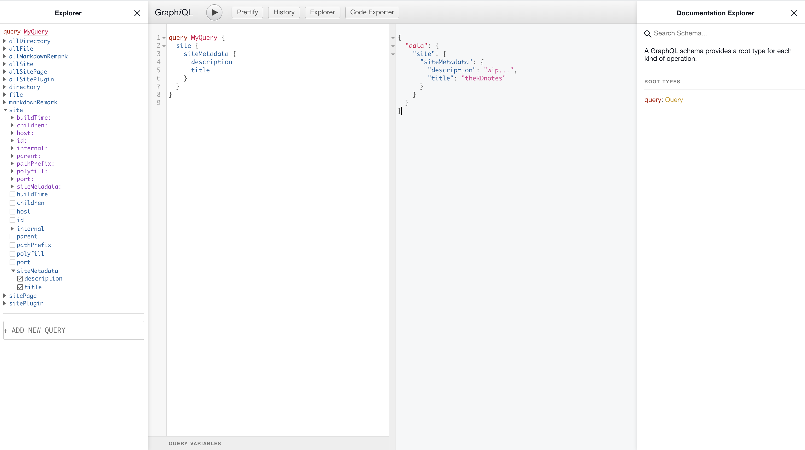

GraphiQL (<em>/ˈɡrafək(ə)l/</em>): A graphical interactive in-browser GraphQL IDE

When your site's development server is running.  
GraphiQL can be accessed at [`http://localhost:8888/___graphql`](http://localhost:8888/___graphql)  

> Mind the port! It may vary.

Below is the screenshot of GraphiQL
 


> Notice the color difference in the explorer on the left side.  
> *Purple* ones are arguments used to filter or sort the data.  
> *Blue* ones are the fields to be selected for the response.  

## queries  

For our blog, we need three GraphQL queries as of now.  
1. Query to fetch site metadata like blog's title, description etc.
2. Query to list all the blog posts on the index page.
3. Query to show the post content on the article page.  

### 1. site metadata query  

The following GraphQL query will fetch the `siteMetadata` stored in `gatsby-config.js`  

```
query SiteMetadataQuery {
        site {
          siteMetadata {
            title
            description
          }
        }
      }
```

You can copy the above query and paste it in the middle pane   
Or  
As shown in the image above, expand the `site` node in the explorer on the left side and then select `siteMetadata → title`  

Hit the play button and examine the result in the panel on the right side.  
You should expect something similar to what's shown in the screenshot above.  

### 2. index page query  

The below query will fetch `excerpt, frontmatter` of all the posts.

```
query SiteIndexQuery {
    allMarkdownRemark(
      sort: { fields: [frontmatter___date_modified], order: DESC }
      filter: { frontmatter: { is_published: { eq: true } } }
    ) {
      edges {
        node {
          id
          excerpt
          frontmatter {
            title
            description
            slug
            date_modified
            author
            is_published
            show_in_recent
          }
        }
      }
    }
  }
```

### 3. blog post query  

The following query utilizes an argument named `slug` to fetch the content for the specific post.  

```
query PostsBySlug($slug: String!) {
    markdownRemark(fields: { slug: { eq: $slug } }) {
      html
      frontmatter {
        title
        date_modified(formatString: "YYYY MMMM Do")
      }
    }
  }
```
"Query Variables" are passed as JSON data.  
Find it at the bottom of the query editor. Click it to expand it.  

You would need to pass the value of argument `slug` as below:  

```json
{
  "slug": "/first-post"
}
```

## whats next!

In the next post, we will implement listing of blog posts on the index page.    