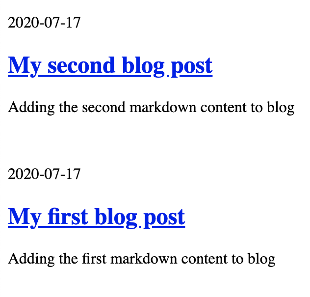

In this post, we will use GraphQL to fetch the details of our posts and show them as a list on index page.

We'll add the following to `src/pages/index.js` file.  

- GraphQL query to fetch details of blog posts that we created in the last post.  
- Code to render the list of posts.

```js
import React from "react";
import { graphql, Link } from "gatsby";

export default ({ data }) => {
  return (
    <>
      <div>
        {data.allMarkdownRemark.edges.map((post) => {
          const {
            title,
            description,
            slug,
            author,
            date_modified,
          } = post.node.frontmatter;
          const excerpt = post.node.excerpt;
          return (
            <>
              <p>{date_modified}</p>
              <Link to={slug}>
                <h2>{title}</h2>
              </Link>
              <p>{description}</p>
              <br />
            </>
          );
        })}
      </div>
    </>
  );
};

export const query = graphql`
  query SiteIndexQuery {
    allMarkdownRemark(
      sort: { fields: [frontmatter___date_modified], order: DESC }
      filter: { frontmatter: { is_published: { eq: true } } }
    ) {
      edges {
        node {
          id
          excerpt
          frontmatter {
            title
            description
            slug
            date_modified
            author
            is_published
            show_in_recent
          }
        }
      }
    }
  }
`;

```

### restart the server 🚦

`npm run dev` and head to `http://localhost:8888/` to see the rendered listing of our posts.




But clicking on any post will result in a `404` default error page. Because we haven't processed our markdown files yet.

In the next post, we'll create a template with which we'll generate individual pages for the blog posts.

---
This [GitHub commit](https://github.com/raevilman/the-rd-notes/commit/ef0ec63f5971511d18924e053891ad9e9d7f3a6d) represents what we've done in this post 🤩
