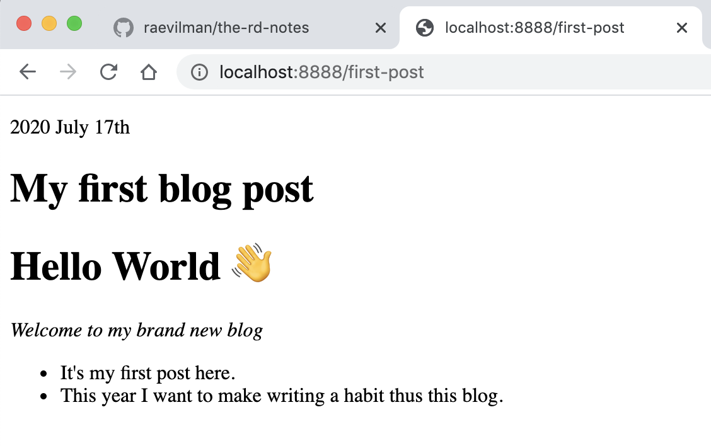

In this post, we will  
- write `blogPostTemplate.js` template file for our blog post.  
- also implement [`createPages`](https://www.gatsbyjs.org/docs/node-apis/#createPages) Gatsby Node API, which will utilize `blogPostTemplate.js` template to dynamically generate static page for each of the posts, in our case markdown file.

### theory

Steps to follow

1. Implement [`createPages`](https://www.gatsbyjs.org/docs/node-apis/#createPages) Gatsby Node API.
2. Query data about all our blog posts using GraphQL.
3. Iterate over each of the post data.
4. Use [`createPage`](https://www.gatsbyjs.org/docs/actions/#createPage) Gatsby action to generate page.  
We'll pass the following info to `createPage` action method.  
   - `path`: URL path to the post
   - `component`: Absolute path to the component responsible for rendering
   - `context`: Context data to be passed for the page.

### practical  

Implement Node API [`createPages`](https://www.gatsbyjs.org/docs/node-apis/#createPages) in `gatsby-node.js` file.  

 The `gatsby-node.js` file should look like as below  

```js
const { createFilePath } = require(`gatsby-source-filesystem`)
const path = require(`path`);

exports.createPages = ({ actions, graphql }) => {
    const { createPage } = actions;
    const blogPostTemplate = path.resolve(
      'src/templates/blogPostTemplate.js'
    );
  
    return graphql(`
      {
        allMarkdownRemark(filter: {frontmatter: {is_published: {eq: true}}}) {
            edges {
              node {
                frontmatter {
                  title
                  description
                  slug
                  date_modified
                  author
                  is_published
                }
              }
            }
          }
      }
    `).then(result => {
      if (result.errors) {
        throw result.errors;
      }
  
      const edges = result.data.allMarkdownRemark.edges;

      edges.forEach(post => {
        createPage({
            path: post.node.frontmatter.slug,
            component: blogPostTemplate,
            context: {
              slug: post.node.frontmatter.slug,
            },
          });
      })
  
      
    });
  };

/* in case you opted for file system path based slug generation

exports.onCreateNode = ({ node, getNode, actions }) => {
  const { createNodeField } = actions
  if (node.internal.type === `MarkdownRemark`) {
    const slug = createFilePath({ node, getNode, basePath: `notes` })
    createNodeField({
      node,
      name: `slug`,
      value: slug,
    })
  }
} */

```

### `blogPostTemplate.js` template file  

Create the file  

```sh
mkdir -p src/templates
touch src/templates/blogPostTemplate.js
```

Add the following to the `blogPostTemplate.js` file  

```js
import React from 'react';
import { Layout } from "../components/Layout";

export default ({ data }) => {
    const { frontmatter, html } = data.markdownRemark;
    return (
      <Layout>
        <p>{frontmatter.date_modified}</p>
        <h1>{frontmatter.title}</h1>
        <div dangerouslySetInnerHTML={{ __html: html }} />
      </Layout>
    );
  };

export const query = graphql`
  query PostsBySlug($slug: String!) {
    markdownRemark(fields: { slug: { eq: $slug } }) {
      html
      frontmatter {
        title
        date_modified(formatString: "YYYY MMMM Do")
      }
    }
  }
`;
```

Above code uses the GraphQL query we discussed in [Part5: GraphiQL](/the-rd-notes/build-a-markdown-blog-with-gatsby/part5-graphiql/) of this series


Restart the server `npm run dev` and test the implementation by clicking on the blog post.



---
This [GitHub commit](https://github.com/raevilman/the-rd-notes/commit/4d13e516579118dfc8db63d6467dbd0f61f7e06e) represents what we've done in this post 🤩