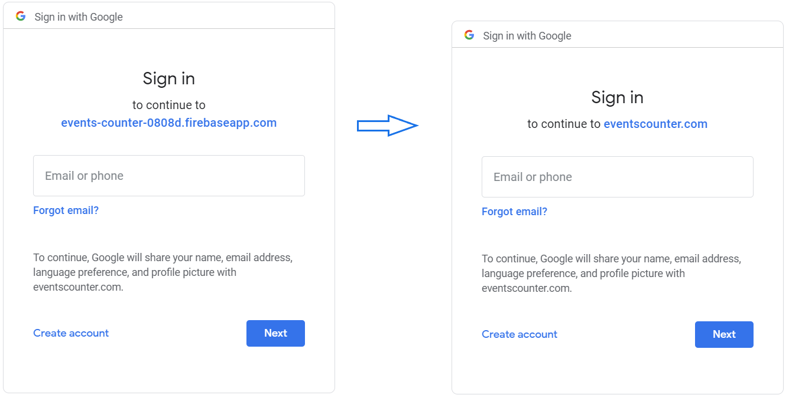

This note is about changing the app name, precisely domain name on Google sign-in consent page.

 

This whole process is taken from [Google Firebase Docs](https://firebase.google.com/docs/auth/web/google-signin#expandable-4)

So below is what I've followed for Events Counter project using Netlify as my hosting provider:

1. Added a `CNAME` in domain settings of Netlify.

   | Key   | Value                                                        |
   | ----- | ------------------------------------------------------------ |
   | Type  | CNAME                                                        |
   | Name  | auth.eventscounter.com                                       |
   | Value | events-counter-0808d.firebaseapp.com (This is your current redirect URL) |

   

2. Authorize custom domain in firebase.

   - Added `auth.eventscounter.com` as custom domain at https://console.firebase.google.com/project/_/hosting/main
   - To verify ownership of this domain, added two `A` type records to Netlify

   > It can couple of hours to finish the verification as your new domain is still propagating across the world DNS servers

3. Next step is to use our new domain in place of old redirect URL being shown at Google sign-in consent page.
   For this, we need to mention it at authorized redirect URLs.

   - Go to https://console.cloud.google.com/apis/credentials (make sure you have selected the right application on top)
   - Edit `Web client` under OAuth 2.0 Client IDs
   - and replace the current redirect URL with the new subdomain suffixed with `/__/auth/handler`, 
     in my case it was `https://auth.eventscounter.com/__/auth/handler`

4. Last step is to update Firebase configuration in web application code.
   Update `authDomain` with the new domain `auth.eventscounter.com`

5. Make sure to update applications on identity providers you are using. For example, I had to update my GitHub app with `https://auth.eventscounter.com/__/auth/handler` as redirect URL.
   Otherwise you will see error like `Unable to process request due to missing initial state.` when trying to you those provider.

That is it!
