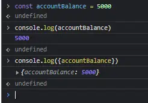
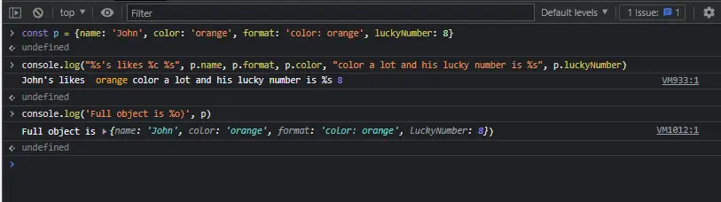

# Log variable names

Log the variable name along with the value by just wrapping it curly braces.

# Formatting

Using string substitutions:

More info at [MDN](https://developer.mozilla.org/en-US/docs/Web/API/console#outputting_text_to_the_console) website.  
