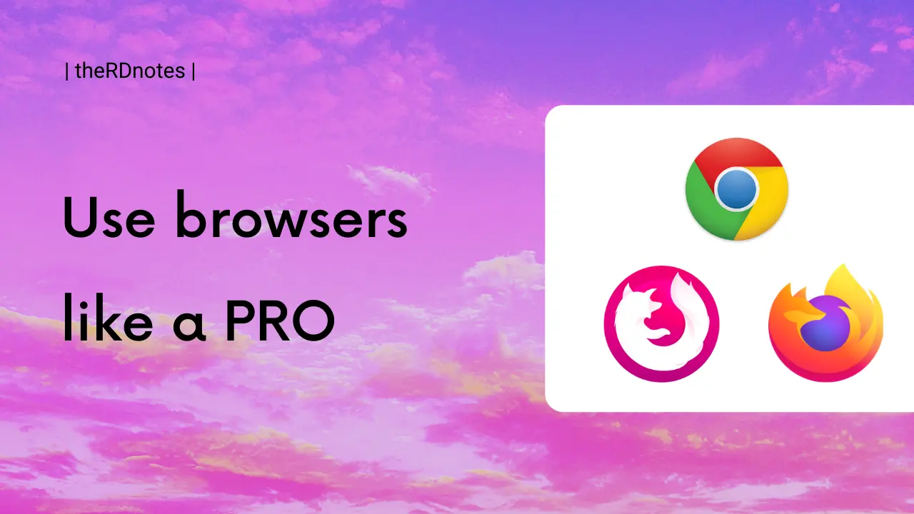

For instance, on my phone, I have three browsers:

1. Default set to Firefox.

2. Firefox Focus, pinned on right bottom for quick access.

3. Google Chrome, pinned on left bottom for quick access

In the January, I [tweeted](https://twitter.com/raevilman/status/1355399469576056832?s=20) about 'How I use multiple Google Chrome profiles?'

But for past couple of months, I have started using multiple browsers along with multiple Chrome profiles.

---

Interested in watching the video version of this thread.
I have upload the vlog on YouTube [here](https://youtu.be/qg7NZWLgL8E). More [verbose] info.

---

So as mentioned above, I use Chrome, Firefox, Firefox Focus on my phone,  
here's how they fit for different purpose.

### The default browser: Firefox.

This comes in situation when I am clicking links in the apps like twitter, email, chats etc.

Because those are random links thus I don't want them to be linked with my Google account, as I am logged into the Chrome, thus separate browser.

So by setting Firefox as default, I am segregating the random links I open via apps, from my Google account, which can result in Google algos recommending useless stuff, which anyways happens but still.

### Temp browser: Firefox Focus

I use it for quick searches, that I don't want to be attached to my profile. 

Eg: 
Searches like ongoing trends, news or sports highlights, this temp browser works well 
and these searches doesn't get attached to my interests in the Google account.

### My online identity: Chrome

Here I am logged into most of my online accounts. 

I open Chrome when I want to access these platforms, which are linked to my Google account. 

Like Twitter, GitHub etc. are all here in Chrome.

---

So that is  it, that's the way how I use browsers for now.
Which has evolved from my last January tweet for sure.

May be more improvements coming in the future 🤷‍♀️  

|  HIH  
|  Take care  
~ @raevilman