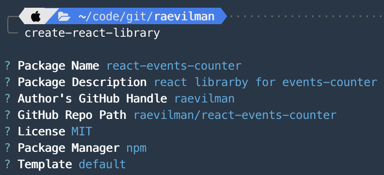
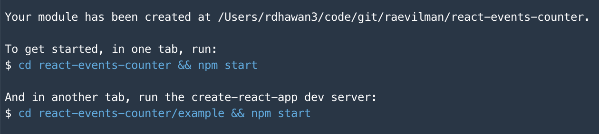

## Setup
We'll use [create-react-library](https://www.npmjs.com/package/create-react-library) CLI tool to generate our library project.  

For this, let's first install `create-react-library` globally:  

```sh
npm install -g create-react-library
```

Now run below command to generate our library project:  
```sh
create-react-library
```

You will be prompted with couple of questions as below:  




After the above command finishes. Notice the output's last few lines as shown below.  



Actually if you `cd` into the folder and notice the content. There is one extra project inside folder named `example`, which is create-react-app application that you can use to test the component that you will build in the library.

To start developing, 
1. run `npm start` in the root folder of your project to compile your source code into `dist` folder every time you do changes in your library code.  
2. run `npm start` from inside of `example` folder to start serving the example project at localhost.  

## Code
Now we have the servers running. Next thing is to understand `src/index.js` and `example/src/App.js`.  
If you notice `src/index.js` it is right now exporting one component `ExampleComponent` and the same is being used in `example/src/App.js`.

If your library is supposed to export only one component. Then you are done here. Go on and start implementing your component in `src/index.js`.

### Multiple components
In my case, I wanted to expose multiple components out of my library.  

For this:  

1. I created a new file for each component under `src/` folder.  
E.g. `src/BasicCounter.js` and `LikeCounter.js`.
2. Then updated `src/index.js` file as below: 

```js
import {BasicCounter} from './BasicCounter'
import { LikeCounter } from "./LikeCounter";

export { BasicCounter, LikeCounter }
```
3. Make the changes in `example/src/App.js` accordingly to test these components: 
```js
import { BasicCounter, LikeCounter} from 'events-counter-react'

const App = () => {
  return (
    <div>
      <span className="counter">Counter</span>
        <BasicCounter text="A basic counter"/>
        <LikeCounter text="Counting the number of likes"/>
    </div>
  )
}
```

Thats it for this note!

