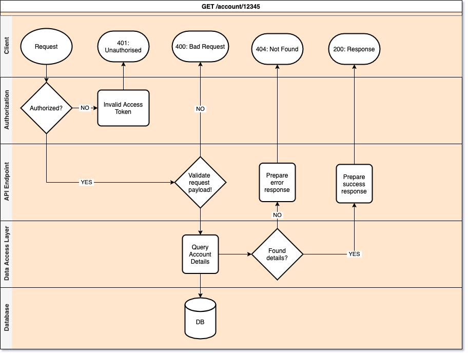

## Thoughts

In one of the upcoming meeting, I was required to showcase the flow of one of the API I had built. Of course, opening the IDE and walking through the code isn't ~~a good~~ an option, when the audience is not of [active] programmers.  

So to present it visually, flowchart is the one that came to my mind first.  
But as a programmer those swimlanes from the sequence diagram, which helps me separate different systems, were also poking my brain a lot.  

So I decided to mix them.  

Below is how a typical REST API flow will look when pictured using flowcharts with swimlanes:

Notice! <i>how the `client` swimlane is showing all the possible response codes</i>  
I liked the outcome. So thought of taking a note to be referred to in future.

## Bonus:
This diagram was created using `draw.io` software and you can find its source file [here](https://github.com/raevilman/the-rd-notes/blob/master/notes/rest-api/rest-api-flowchart-with-swimlanes.drawio).

