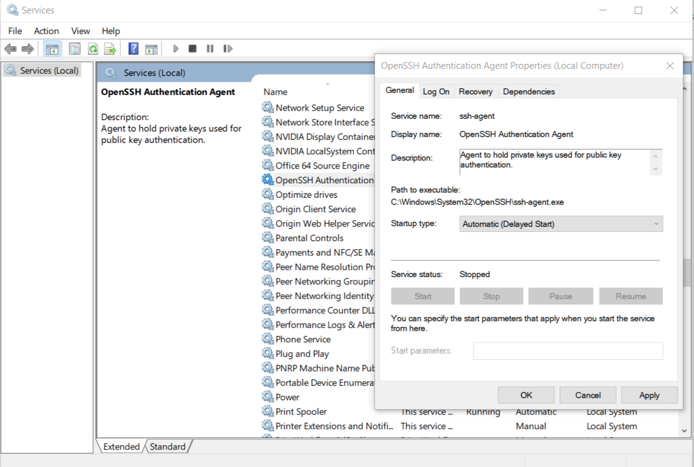

Notes on setting up Git on Windows with SSH as auth mechanism.  

Below are the steps we'll do:  

- Installation
- Setup SSH
- Configure user details

## Installation
For installation i've downloaded the package from [gitforwindows](https://gitforwindows.org/) which is port of Git SCM to specific to the Windows OS.  

> I forgot to capture screens while installing. May be next time.

## SSH

### Create key

I've used following command to generate the SSH key.  

```sh
ssh-keygen -t rsa -b 4096 -C "your_email@example.com"
```

> Make sure to provide passphrase with length more than 5 characters.

### Awaken the SSH agent

`ssh-agent` is the guy who does all the authentication related communication with the servers.  
And is disabled by default in Windows.  
So hit the start menu, search for Services and open it.  
Find 'OpenSSH Authentication Agent' and enable it from its properties window(right click to find properties)  

Screenshot:



### Tell the GitHub
So you got your ssh key and the agent running. Now its time to tell the GitHub about your key so that authentication can happen.  
We'll provide our public key to GitHub which normally resides at `C:\Users\your_user_name\.ssh\id_rsa.pub`  

Copy its content using any text editor or by using below command to print the content in console.  
```sh
type C:\Users\your_user_name\.ssh\id_rsa.pub
```
> CAUTION: Be aware there is also another file `C:\Users\your_user_name\.ssh\id_rsa` and thats the private key and should be kept private. NOT TO BE SHARE AROUND.  

Now go to GitHub's [SSH Keys](https://github.com/settings/keys) page and hit the 'New SSH key' button. Give it a name so thats easy to recognize which machine's key is this and paste the content in the key section.  

## Configure User Details

Time to configure user details for git, so that your commits can be linked to your GitHub account.  

I've used below commands for same:  

```sh
git config --global user.name "Your Name"
git config --global user.email your_email@users.noreply.github.com
```

Notice the email, I am using GitHub provided noreply email. This helps me hide my personal email in git logs. You can get yours from GitHub's [Emails Settings](https://github.com/settings/emails) page.  

> Tip: You can also use the same noreply email for your web commits as well. Just check the 'Keep my email addresses private' box on the same page.

---

Thats it for this note 👋  
HIH
