Below diagram explains what we are going to do.

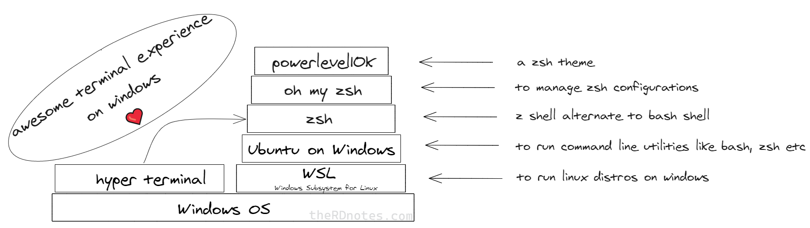

So to list the steps, we'll
- Install WSL (Windows subsystem for linux)
- Install Ubuntu from Microsoft store
- Install hyper terminal
- Install zsh shell
- Install oh my zsh
- Install PowerLevel10k
- Colors
- Plugins
- Points worth noting

## Installations

### WSL
I just enabled 'Windows Subsystem for Linux' in  Windows Feature and restarted the system.  

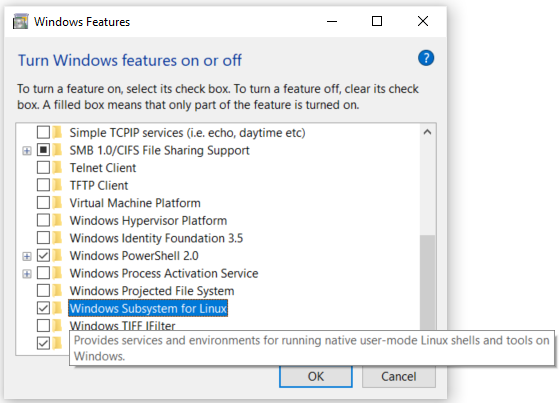

You can follow the instructions on [Microsoft website](https://docs.microsoft.com/en-us/windows/wsl/install-win10).  

---

### Ubuntu
For this, visit this [Microsoft Store](https://www.microsoft.com/en-us/p/ubuntu/9nblggh4msv6) webpage and install it.  
> *Download size 444.5MB on 05-12-2020*

After it is installed. Open it from start menu to continue installation.  
Setup will ask for a username for linux subsystem.  


After entering username, the setup will finish.  

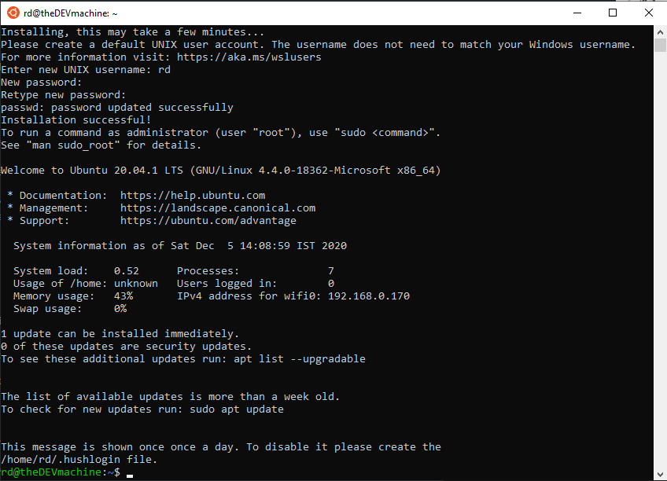

---

### Hyper

- Download the installer from https://hyper.is/
- Install it

Lets tie hyper with Window's bash now.  
- Open Hyper's configuration file with `ctrl+,`.  
- Scroll down and edit `shell`'s value to `C:\\Windows\\System32\\bash.exe`.  
- Re-launch the Hyper terminal.

Update the packages with following command  
```sh
sudo apt update && sudo apt upgrade
```

---

### ZSH
Install ZSH with following command
```sh
sudo apt-get install zsh
```

Make ZSH our default shell. Open your bash profile with  
```sh
vim ~/.bashrc
```

> ⚠ Warning: [Do not change Linux files using Windows apps and tools](https://devblogs.microsoft.com/commandline/do-not-change-linux-files-using-windows-apps-and-tools/)  
> 

Add following in the very begining of the file  
```
bash -c zsh
```
save and relaunch Hyper and you will be greeted with following screen.  

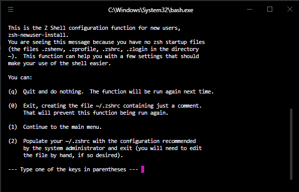

Setup completes with following screen:  

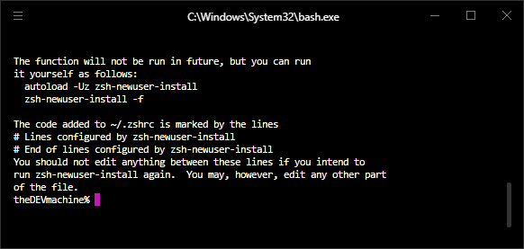

---

### OH MY ZSH
Next, lets install 'OH MY ZSH' with following command:  
```sh
sh -c "$(curl -fsSL https://raw.githubusercontent.com/robbyrussell/oh-my-zsh/master/tools/install.sh)"
```  

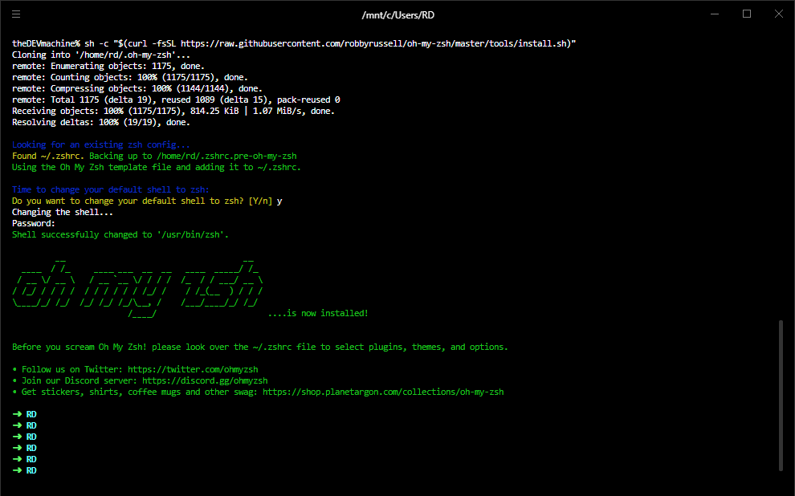

---

### PowerLevel10k  

Install the recommended font 'Meslo Nerd Font':
> Why?   
> *Icons will render properly with this font*

You can download the fonts from this [GitHub](https://github.com/romkatv/powerlevel10k#meslo-nerd-font-patched-for-powerlevel10k) page.  

After you have installed(open and click install button on top) the fonts, Open Hyper Terminal config file with `ctrl+,` and add 'MesloLGS NF,' in front of the existing value for `fontFamily` key.  

Now, for PowerLevel10k, you can follow the guide at https://github.com/romkatv/powerlevel10k

Steps I've followed:  

1. Installation of PowerLevel10k for Oh My Zsh
    ```
    git clone --depth=1 https://github.com/romkatv/powerlevel10k.git $ZSH_CUSTOM/themes/powerlevel10k
    ```

2. Set `ZSH_THEME="powerlevel10k/powerlevel10k"` in `~/.zshrc`.  
3. Restart zsh.  
4. You will be prompted with the configuration wizard for PowerLevel10k. If not, type `p10k configure` if the configuration wizard doesn't start automatically.  

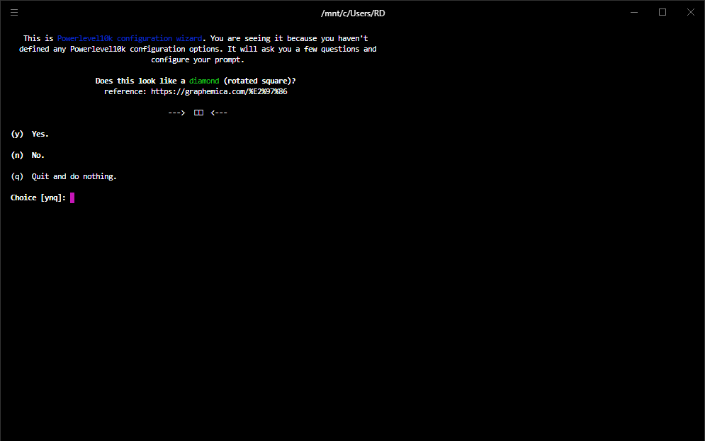

After doing the configuration, my terminal looked like below:  

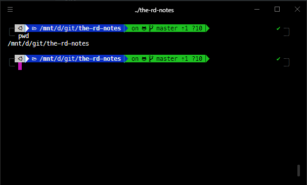  

---

### Colors

The colors were a little bit bright for me. So I installed a theme for hyper terminal named 'hyper-material-theme' from [Hyper Website](https://hyper.is/store/hyper-material-theme) using below command:  

> ⚠ Make sure you are running the hyper command from windows terminal. Meaning you are out zsh or linux terminal per se.  
> Use exit command to get out of zsh.
> 
```sh
hyper i hyper-material-theme
```

Now colors are nice!  

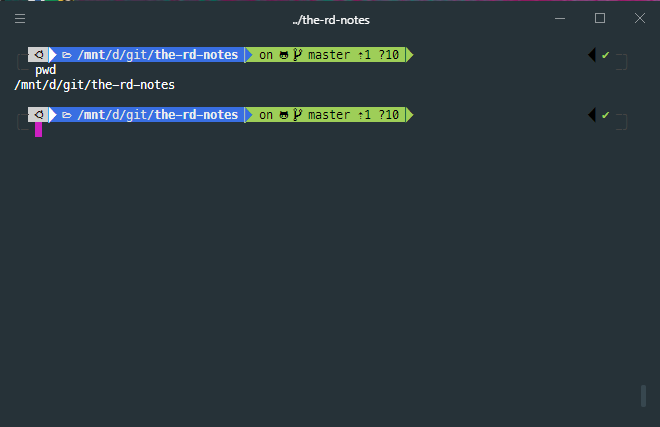

---

### Plugins  


#### zsh-autosuggestions  
This plugin will suggest command as you write from the terminal history.  
Just use `→` right arrow key to complete the command. 
 
Link: https://github.com/zsh-users/zsh-autosuggestions  

 Steps I followed:  
 1. Installation
    ```
    git clone https://github.com/zsh-users/zsh-autosuggestions ${ZSH_CUSTOM:-~/.oh-my-zsh/custom}/plugins/zsh-autosuggestions
    ```
 2. To activate the autosuggestions, add it to plugin list in your .zshrc:  
    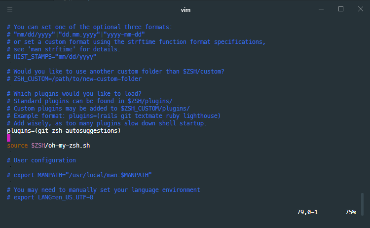
 3. You will also need to force reload of your .zshrc:  
    ```
    source ~/.zshrc
    ```
Try typing any command if its available in the history, you will see suggestion as below and then you press `->` right arrow key to complete it.  
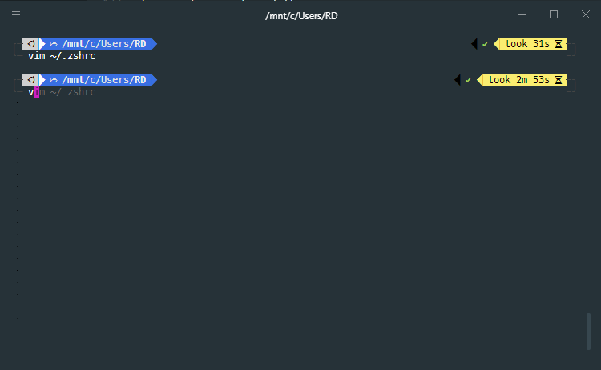  

---

### Points worth noting:

#### NodeJs Projects 
I have moved these node related notes to separate space [here](/nvm-for-windows-subsystem-for-linux) 

### Misc
- Do not try to copy text with `ctrl+c` while a command is running 😁.  

----

Thats it for this note.  
HIH
~ RD


