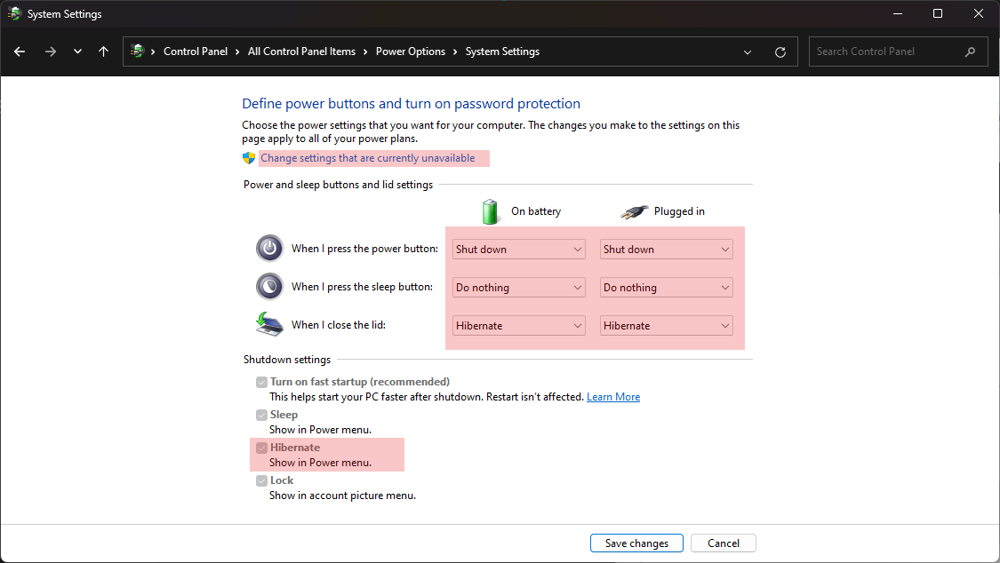

This note is about all the steps I've take when setting up the new Windows machine.  

Below are the steps in order:  
- User directory
- Uninstall bloatware
- Update system
- Partition drive
- Installations
- Configurations
- Issues

## User Directory
When setting up Windows, I used Outlook account to login into the OS.  

While setting up the environment I found that the name of the folder for my user under `C:\Users` wasn't correct and I knew that I wont be happy seeing this in future while using console or in general. So I decided to change before proceeding further.  

> Do not event think of just renaming it. It may mess up the system.  

The steps I followed:  
- Create a new local user with admin role from Settings > Accounts > Family & other users.  
Mind the username as the folder will be created using this name under `c:\Users`
- Copy the stuff (if any) from bad (original) user's folder to a common place like other drive partition.
- Sign out of the bad user account.
- Log in to the new user account.
- Remove the old user from Settings > Accounts > Family & other users.
- Sign in with Outlook account from new local account

Now you have the same Outlook account to log in to the system but your desired folder name for your user.  

## Uninstall bloatware

Uninstall the pre-installed softwares that you know you wont need.  
I remember uninstalling:  
- McAfee Antivirus and Web Advisor
- Skype (I don't need this, so...)
- Removed apps like Solitaire, Adobe Express etc from start menu. I guess these were just shortcuts to installation.
- may be some more ...

## Update the system

Put the system to download and install updates. Restarted it and then again put it on updates. After one or two restarts, the system was fully updated.  

## Partition the drive
Simple reason, I don't want the user data to participate when backing up the system. Which can result in huge backup files.  

After giving it a thought for some time, I decided that I need four partitions:  
- System
- Code
- Programs
- Data

### System
This partition is for the Windows OS.  
### Code
Home for all the source code I'll be dealing with.  
It will have folders like:
- git
  - raevilman (my git repositories)
  - clones (other users repositories)
- local
  - experimental code

Plus it will also store:  
- Docker volumes
- Virtual disks for VirtualBox etc
- etc

### Programs
This is where I'll install heavy programs like games etc. So that the system drive is not overloaded.

### Data
Personal data goes here. Music, Movies, Photos etc etc etc

Bring up the calculator!  

With the total of 952GB of storage. Below is how I've distributed the space among four partitions:  

- System - 250GB
- Code - 100GB
- Programs - 200GB
- Data - 400GB

> 140GB is already taken by Fortnite and Apex Legends in the Programs partition 😯

## Installations

### Antivirus
I haven't bought any. So relying for now on Windows Defender.  

### Browser
Chrome, you know that.  
Download and set this as default under Settings > Apps >  Default Apps

### Terminal

I prefer to use [Cmder](https://cmder.net/) over CMD or PowerShell.  
Check the guide to setup Cmder [here](/setup-cmder-terminal).

### IDEs
- VS Code.  
    Who doesn't love VS Code. The best tool from Microsoft.  
    Setup guide is [here](/setup-vs-code).
- IntelliJ IDEA
- PyCharm

### Languages
- Python  
Strangely, when I entered `python` command in `cmd` to check whether it is installed or not. It open python app page in Microsoft Store. So for now I did install it from the store.    

- Node.js

### Git

Setting up git includes:  
- Installation
- Configure the ssh
- Configure user profile.  

Check the guide [here](/setup-git-on-windows)

### Other Utility Softwares

- Insomnia  
I've replaced Postman with Insomnia REST Client.  
Very nice, modern and clean UI in comparison to Postman's cluttered interface.  
Switched from Postman mainly because of its flawed (and irritating) variables handling.  
Download from [here](https://insomnia.rest/download)

- 7-Zip  
The free and open source file archiver. Download from [here](https://www.7-zip.org/download.html).

## Configurations
- Explorer View
  - Item check boxes
  - Show file extensions
  - Show hidden files  
  
    

- Do nothing on lid close  
 
     

## Issues

### Bluetooth Audio Stuttering
Faced this issue, where the audio to bluetooth connected headsets was stuttering/breaking a lot.  
Fix for my case is explained [here](/windows-bluetooth-audio-stutter-issue).  

