Below diagram explains what we are going to do.


So to list the steps, we'll
- Install WSL (Windows subsystem for linux)
- Install Ubuntu from Microsoft store
- Install zsh shell
- Install oh my zsh
- Install PowerLevel10k
- Plugins
- Choose a terminal
- Colors
- Points worth noting

---
</br></br>

/\  
Watch the video instead 👉 [YouTube Link](https://youtu.be/nQTgHDDPU0Y), covers each step.  

</br></br>

---

## Installations

### WSL
I just enabled 'Windows Subsystem for Linux' in  Windows Feature and restarted the system.  

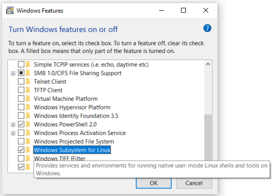

You can follow the instructions on [Microsoft website](https://docs.microsoft.com/en-us/windows/wsl/install-win10).  

---

### Ubuntu
For this, visit this [Microsoft Store](https://www.microsoft.com/en-us/p/ubuntu/9nblggh4msv6) webpage and install it.  
> *Download size 444.5MB on 05-12-2020*

After it is installed. Open it from start menu to continue installation.  
Setup will ask for a username for linux subsystem.  


After entering username, the setup will finish.  

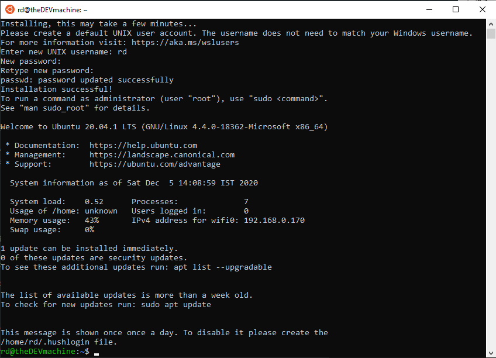

Update the packages with following command  
```sh
sudo apt update && sudo apt upgrade
```

---

### ZSH
Install ZSH with following command
```sh
sudo apt-get install zsh
```

Make `zsh` the default shell with following command:  
```sh
 chsh -s /usr/bin/zsh 
```

Restart the Ubuntu app and you should be greeted with following screen:    


Complete the configuration as per your liking.  

---

### OH MY ZSH
Next, lets install 'OH MY ZSH' with following command:  
```sh
sh -c "$(curl -fsSL https://raw.githubusercontent.com/robbyrussell/oh-my-zsh/master/tools/install.sh)"
```  

Below is the screenshot of completed installation.  

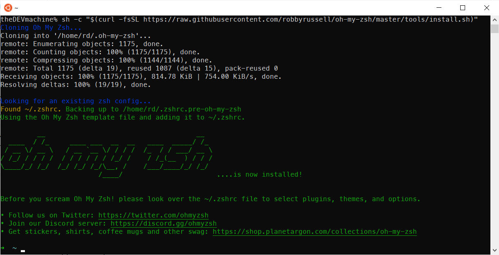

---

### PowerLevel10k  
Time to spice up the terminal with a nice theme.  

But before that, Install the recommended font 'Meslo Nerd Font':
> Why?   
> *Icons will render properly with this font*

You can download the fonts from this [GitHub](https://github.com/romkatv/powerlevel10k#meslo-nerd-font-patched-for-powerlevel10k) page.  

> To install a font, open it and click install button on top

#### Install PowerLevel10k  

Now, for PowerLevel10k, you can follow the guide at https://github.com/romkatv/powerlevel10k

Below are the steps I've taken:  

1. Installation of PowerLevel10k for Oh My Zsh
    ```
    git clone --depth=1 https://github.com/romkatv/powerlevel10k.git $ZSH_CUSTOM/themes/powerlevel10k
    ```

2. Set `ZSH_THEME="powerlevel10k/powerlevel10k"` in `~/.zshrc`.  
3. Restart the Ubuntu app.  
4. You will be prompted with the configuration wizard for PowerLevel10k. If not, type `p10k configure` if the configuration wizard doesn't start automatically.  

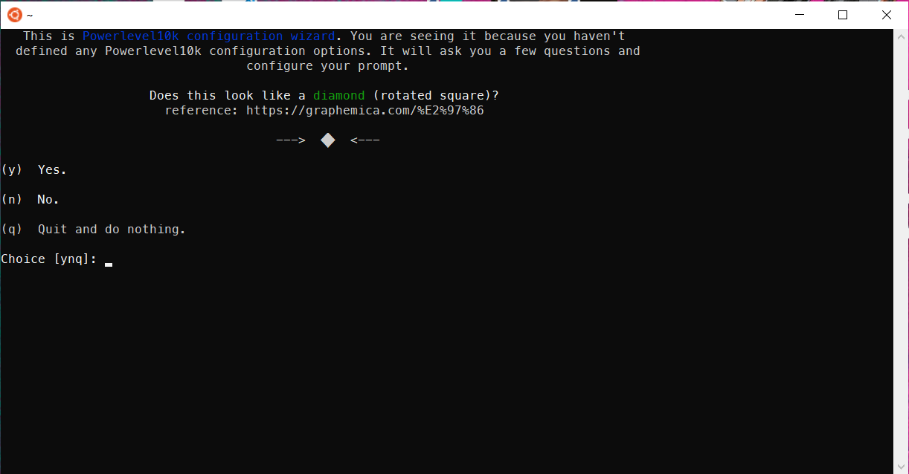

After doing the configuration, my terminal looked like below:  

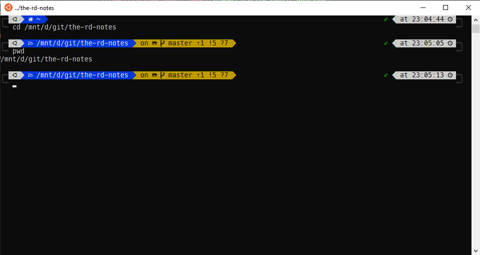  

---

### Plugins  


#### zsh-autosuggestions  
This plugin will suggest command as you write from the terminal history.  
Just use `→` right arrow key to complete the command. 
 
Link: https://github.com/zsh-users/zsh-autosuggestions  

 Steps I followed:  
 1. Installation
    ```
    git clone https://github.com/zsh-users/zsh-autosuggestions ${ZSH_CUSTOM:-~/.oh-my-zsh/custom}/plugins/zsh-autosuggestions
    ```
 2. To activate the autosuggestions, add it to plugin list in your .zshrc:  
    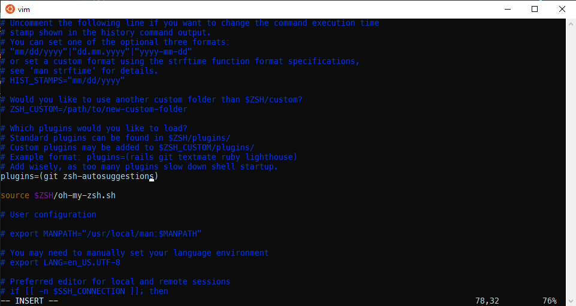
 3. You will also need to force reload of your .zshrc:  
    ```
    source ~/.zshrc
    ```
Try typing any command if its available in the history, you will see suggestion as below and then you press `->` right arrow key to complete it.  
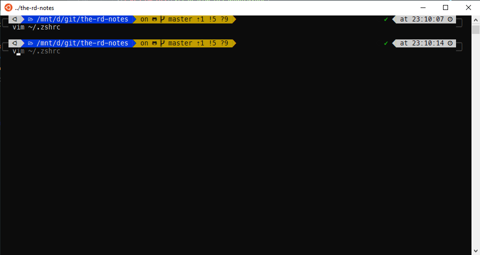  

---

### Choose a terminal  

So far we have just configured a shell, zsh in this case.  

Time to pick a terminal of choice.  

Terminals are dumb. They are just UI layer. They take input and pass it on (to a shell for example).
You can choose any terminal like Hyper, cmder, Windows Terminal etc etc.

Up till now, we have been using the Ubuntu app as our terminal. You can continue using that and it works fine.  

In case you want to switch, below i have notes on few of them.  


<details>
<summary>Windows Terminal</summary>

   ### Install
Install it from [Microsoft Store](https://www.microsoft.com/en-us/p/windows-terminal-preview/9n0dx20hk701)

### Font
Open its settings from the dropdown and add `fontFace` to the profile named `Ubuntu` as shown below  

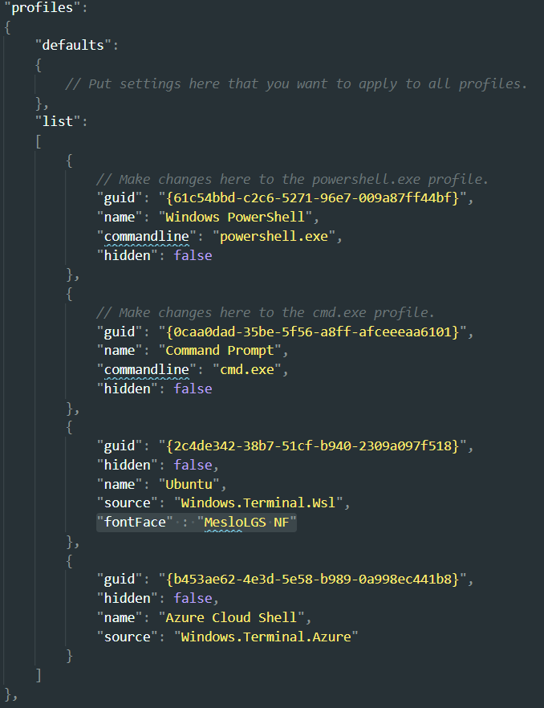

### Default Profile
By default it opens up PowerShell. You can change it by assigning the `GUID` of `Ubuntu` profile to the `defaultProfile` in the settings.  


</details>

---

<details>
  <summary>Hyper</summary>

### Install
- Download the installer from https://hyper.is/
- Install it

### Font
Make hyper use the custom font we installed earlier.  
Open Hyper Terminal config file with `ctrl+,` and add 'MesloLGS NF,' in front of the existing value for `fontFamily` key.  

### Shell
Lets tie hyper with Window's bash now.  
- Open Hyper's configuration file with `ctrl+,`.  
- Scroll down and edit `shell`'s value to `C:\\Windows\\System32\\bash.exe`.  
- Configuration we did in last step, will always open `bash` shell in Hyper.  
To switch to ZSH on startup, Open your bash profile with  
```sh
vim ~/.bashrc
```
  Add following in the very beginning of the file  
```
zsh
```
- Save and relaunch Hyper.  
 
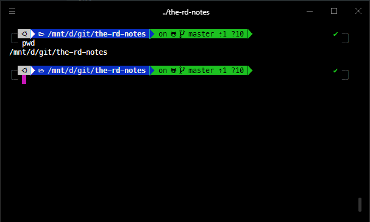  

### Colors

The colors were a little bit bright for me. So I installed a theme for hyper terminal named 'hyper-material-theme' from [Hyper Website](https://hyper.is/store/hyper-material-theme) using below command:  

> ⚠ Make sure you are running the hyper command from windows terminal. Meaning you are out zsh or linux terminal per se.  
> Use exit command to get out of zsh.
> 
```sh
hyper i hyper-material-theme
```

Now colors are nice!  

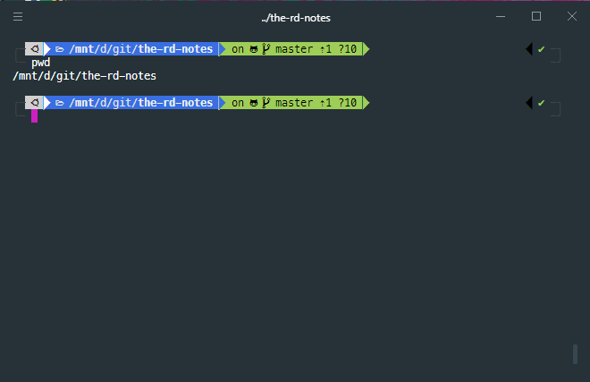

### Issue

One issue I noticed with hyper terminal is that it doesn't refresh/clear the screen after nano editor is closed.  

As shown below, Hyper(on left) and Windows Terminal(on right) after closing nano editor.  

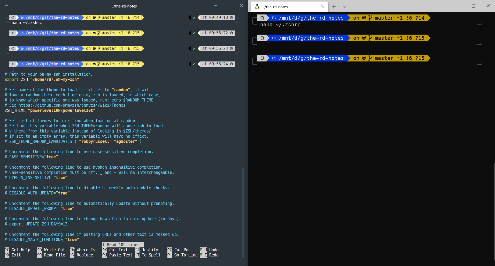

</details>

---

<details>
  <summary>Cmder</summary>

### Install
- Download the installer from https://cmder.net/
- Install it

### Font
Make Cmder use the custom font we installed earlier.  
Open settings and select 'MesloLGS NF' as shown below  

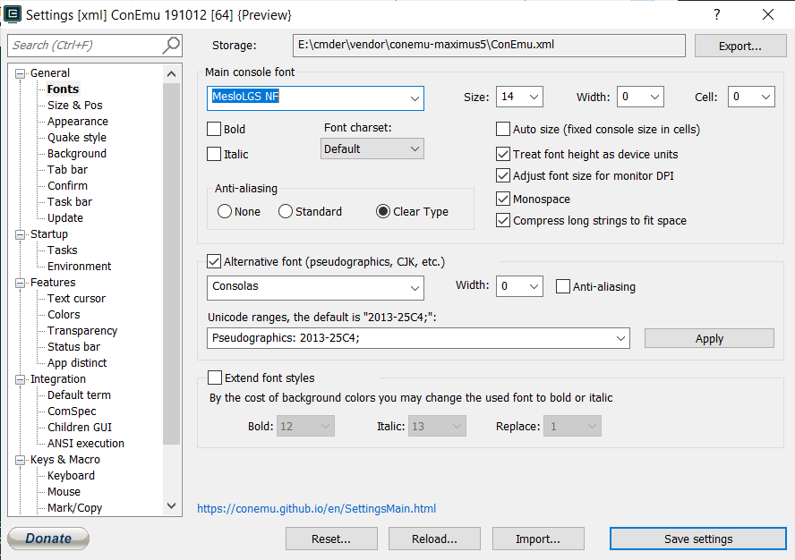  

### Shell
Lets tie cmder with Window's bash now.  

Add a new task in cmder's settings window as shown below  

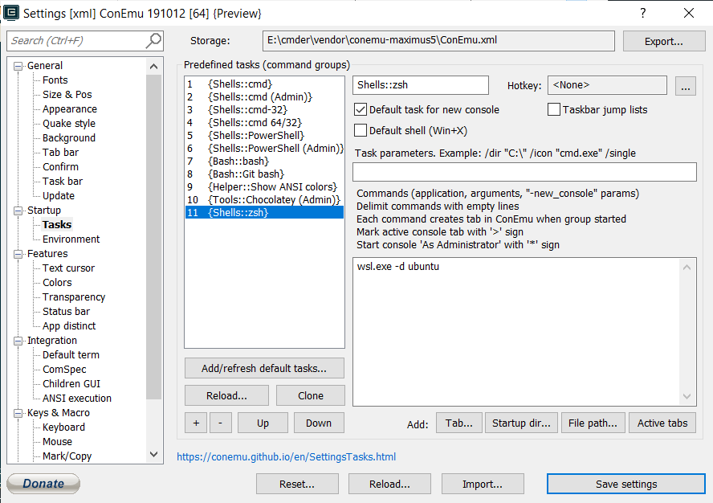  

- Save and relaunch Cmder.  
 
</details>

---


### Points worth noting:

- #### ⚠ [Do not change Linux files using Windows apps and tools](https://devblogs.microsoft.com/commandline/do-not-change-linux-files-using-windows-apps-and-tools/)  


- #### NodeJs Projects 
   I have moved these node related notes to separate space [here](/nvm-for-windows-subsystem-for-linux) 

- ### Misc
  - Do not try to copy text with `ctrl+c` while a command is running 😁.  

----

Thats it for this note.  
HIH
~ RD


