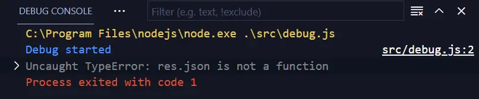
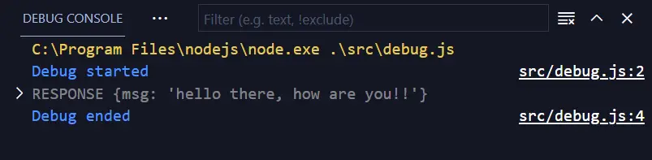

This note is about how I managed to debug Vercel Serverless Functions locally.

## VLog
If you prefer to watch the video instead of reading article,  
its available at https://youtu.be/giEL-ZLE6C4  
Length: 05:22 mins  


## debug.js 

As the vercel functions are exporting a function which takes `(req, res)`,  
I imported this function in another file and called it by passing fake/empty `(req, res)`.  
For this, created a file `src/debug.js` with following content:  
```js
const api = require("../api/hello");
console.log("Debug started");
api({}, {});
console.log("Debug ended");
```

## Debug config
Then added a file `.vscode/launch.json`, with following content:  
```json
{
  "version": "0.2.0",
  "configurations": [
    {
      "type": "pwa-node",
      "request": "launch",
      "name": "Launch Program",
      "skipFiles": ["<node_internals>/**"],
      "program": "${workspaceFolder}\\src\\debug.js"
    }
  ]
}

```

With the above file, I have now got a debug configuration in VS Code's `Run and Debug (CTRL+SHIFT+D)` side window.  
Now I can click(play button) and start the debugging.  

Do not forget to add the breakpoint(s) in your Vercel Function script file.  


## Fake more
At this point, I was able to debug and fix my code, but the API function didn't run till end as I was using `res.json()` method to return the response, which clearly was missing in our fake `res` object passed initially.  

Debugging output:  



So to make it work, I passed fake `json()` method as part of `res` object, which just prints to the console.  

Now the `debug.js` file looks like this  

```js
const api = require("../api/hello");
console.log("Debug started");
api({}, { json: (response) => console.log("RESPONSE", response) });
console.log("Debug ended");

```

Debugging now prints as below:  


---


That's it about this note.  
HIH

~ [@raevilman](https://twitter.com/raevilman) 🐦 


