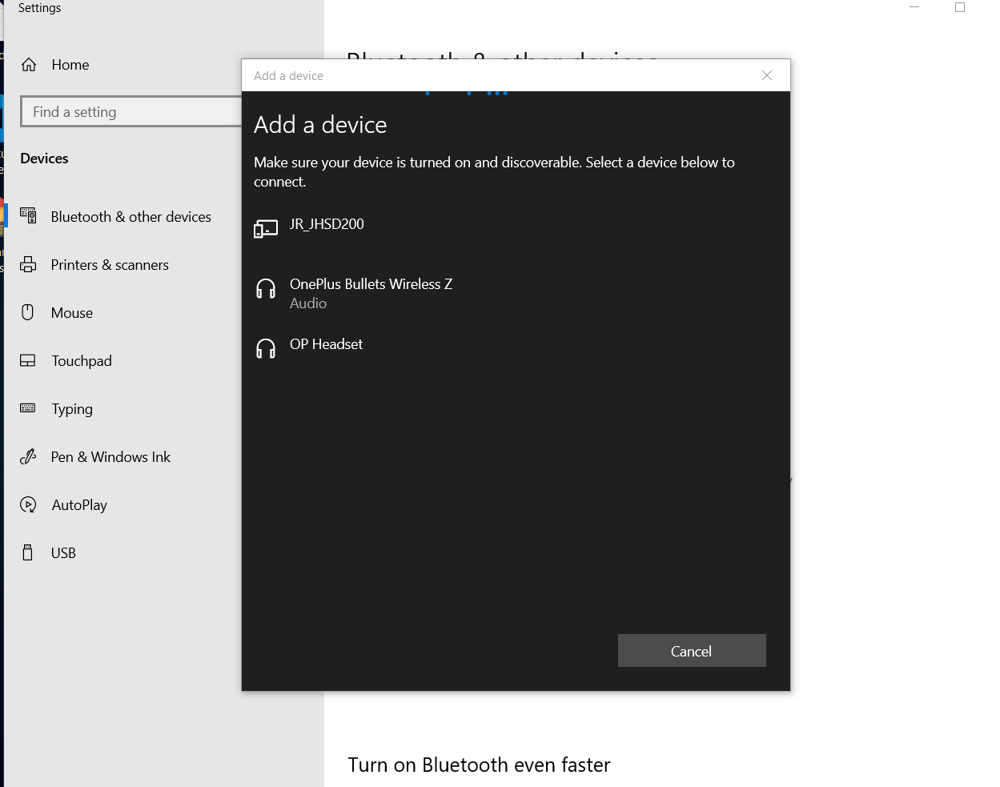
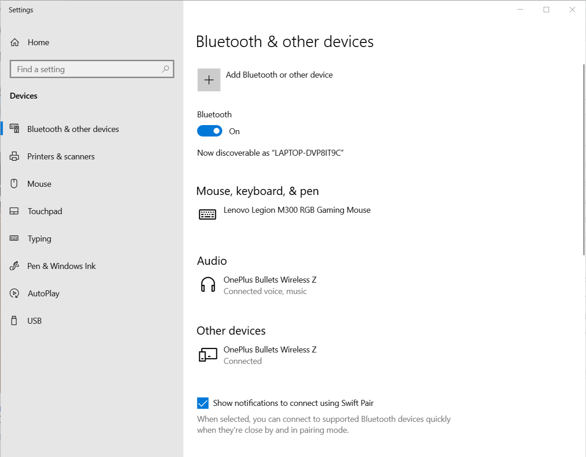
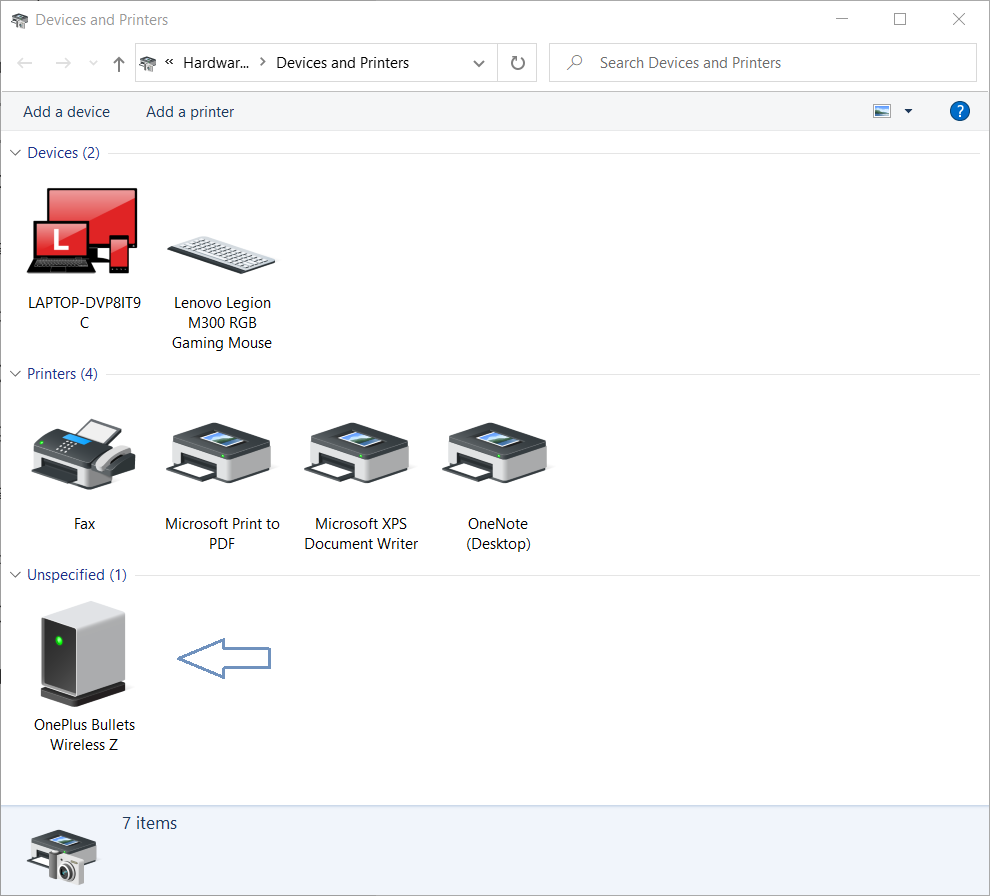

I was disappointed when I first connected my bluetooth earphones to my newly bought Windows laptop. Tried couple of solutions from the internet but in vain.  

Below is what I found and how I fixed it.  

## Mistake #1
The mistake happened in the very first step when I tried pairing them for the first time.  

As you see in below screenshot, last two entries appeared for OnePlus Bullets Z and the mistake, I clicked on the last one.  

## Mistake #2
When I didn't hear any sound coming out of earphones. I paired the second device from the above list. Guess what I forgot to remove the one added earlier.  

Now there were two bluetooth devices with same name. Strangely one listed under 'Other devices' and this was the one causing problem.  

## Problem
If you notice in above screenshot, both the devices are in connected state and thats the problem causing stuttering.

## Solution

Solution was simple but not that I realized in the first place and tried couple of offerings from the internet. Which didn't work for me.

In my case, the solution was to remove the device listed under 'Unspecified' section from 'Devices and Printers' page.  

Once removed. I re-connected my earphones and voilà smooth, crisp sound hitting my ear drums with smile on the face.  

